🏗️ 智研匹配系统 - 图形分解

---

## 📊 系统总体架构

```mermaid
flowchart TB
    %% 顶层标题
    SYS[通用权限管理系统]

    %% 左 - 菜单管理
    subgraph 菜单管理
        M_ROOT[菜单管理]
        M_STRUCT[菜单结构管理]
        M_Q[查询菜单]
        M_A[添加菜单]
        M_E[修改菜单]
        M_D[删除菜单]
    end

    %% 中左 - 角色管理
    subgraph 角色管理
        R_ROOT[角色管理]
        R_CORE[角色管理]
        R_PRIV[角色权限管理]
        R_ADD[添加角色]
        R_EDIT[修改角色]
        R_DEL[删除角色]
        R_QPRIV[查询角色权限]
        R_MODPRIV[修改角色权限]
        R_ADDPRIV[添加角色权限]
    end

    %% 中右 - 用户管理
    subgraph 用户管理
        U_ROOT[用户管理]
        U_CORE[用户管理]
        U_PRIV[用户权限管理]
        U_Q[查询角色权限]
        U_MOD[修改角色权限]
        U_ADD[添加角色权限]
        U_DEL[删除角色权限]
        U_ASSIGN[用户角色分配]
    end

    %% 右 - 其它
    subgraph 其他
        O_LOGIN[登录]
        O_LOGOUT[注销]
    end

    %% 连接关系
    SYS --> M_ROOT
    SYS --> R_ROOT
    SYS --> U_ROOT
    SYS --> O_LOGIN
    SYS --> O_LOGOUT

    M_ROOT --> M_STRUCT
    M_STRUCT --> M_Q
    M_STRUCT --> M_A
    M_STRUCT --> M_E
    M_STRUCT --> M_D

    R_ROOT --> R_CORE
    R_CORE --> R_ADD
    R_CORE --> R_EDIT
    R_CORE --> R_DEL
    R_ROOT --> R_PRIV
    R_PRIV --> R_QPRIV
    R_PRIV --> R_MODPRIV
    R_PRIV --> R_ADDPRIV

    U_ROOT --> U_CORE
    U_CORE --> U_Q
    U_CORE --> U_MOD
    U_CORE --> U_ADD
    U_CORE --> U_DEL
    U_ROOT --> U_PRIV
    U_PRIV --> U_ASSIGN

    classDef colA fill:#f8fbff,stroke:#2b6cb0
    classDef colB fill:#f9f7ff,stroke:#6b46c1
    classDef colC fill:#f0fff4,stroke:#1f8a4c
    classDef colD fill:#fff7f0,stroke:#c65615

    class M_ROOT,M_STRUCT,M_Q,M_A,M_E,M_D colA
    class R_ROOT,R_CORE,R_PRIV,R_ADD,R_EDIT,R_DEL,R_QPRIV,R_MODPRIV,R_ADDPRIV colB
    class U_ROOT,U_CORE,U_PRIV,U_Q,U_MOD,U_ADD,U_DEL,U_ASSIGN colC
    class O_LOGIN,O_LOGOUT colD
```
```

```

**用户角色说明**:

- **学生**: 项目浏览、AI匹配、在线申请、进度跟踪
- **教师**: 项目发布、申请审核、实习管理、AI辅助
- **管理员**: 用户管理、系统监控、数据统计、权限配置

### 2️⃣ 前端层 (Frontend Layer)
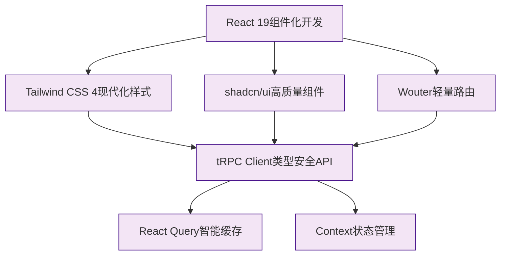

**前端技术特点**:
- **类型安全**: TypeScript + tRPC 端到端类型安全
- **现代化UI**: React 19 + Tailwind CSS 4
- **组件化**: shadcn/ui 高质量组件库
- **状态管理**: React Query + Context 组合使用

### 3️⃣ API层 (API Layer)
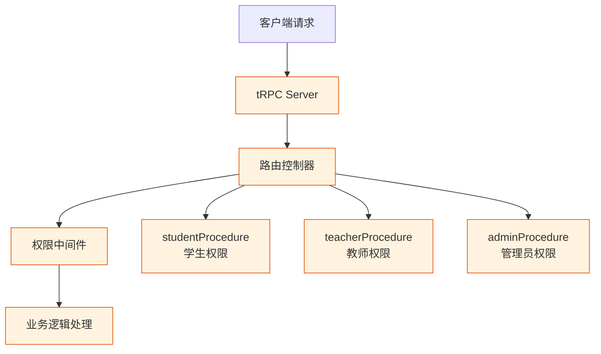

**API设计特点**:
- **端到端类型安全**: 前后端类型自动同步
- **权限控制**: 基于角色的访问控制
- **自动生成**: API文档自动生成，无需手动维护

### 4️⃣ 后端服务层 (Backend Services)
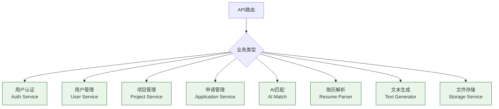

**服务模块说明**:
- **核心业务**: 用户、项目、申请的基础CRUD操作
- **AI服务**: 智能匹配、内容生成等AI功能
- **文件服务**: 简历上传、存储管理

### 5️⃣ 数据层 (Data Layer)
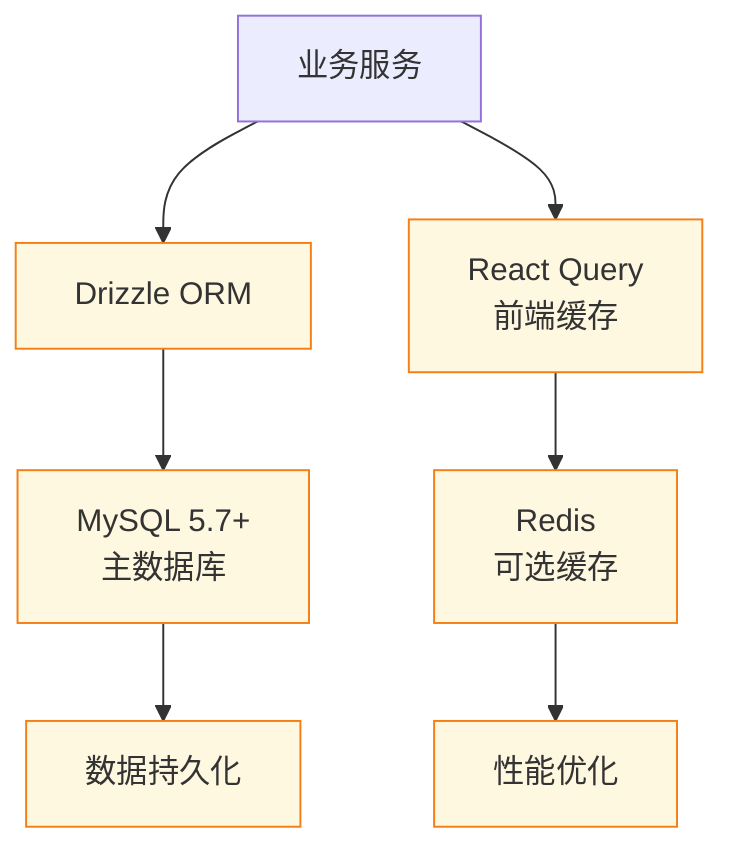

**数据架构特点**:
- **类型安全**: Drizzle ORM提供编译时类型检查
- **性能优化**: Redis缓存提升查询性能
- **关系完整性**: 外键约束保证数据一致性

### 6️⃣ AI服务层 (AI Services)
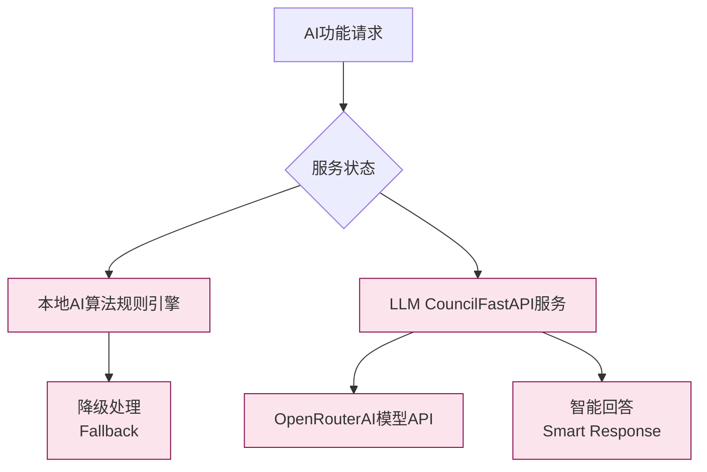

**AI架构特点**:
- **双重保障**: 本地算法 + 外部AI服务
- **智能降级**: 服务异常时自动切换
- **性能监控**: AI调用统计和质量评估

### 7️⃣ 部署架构 (Deployment)
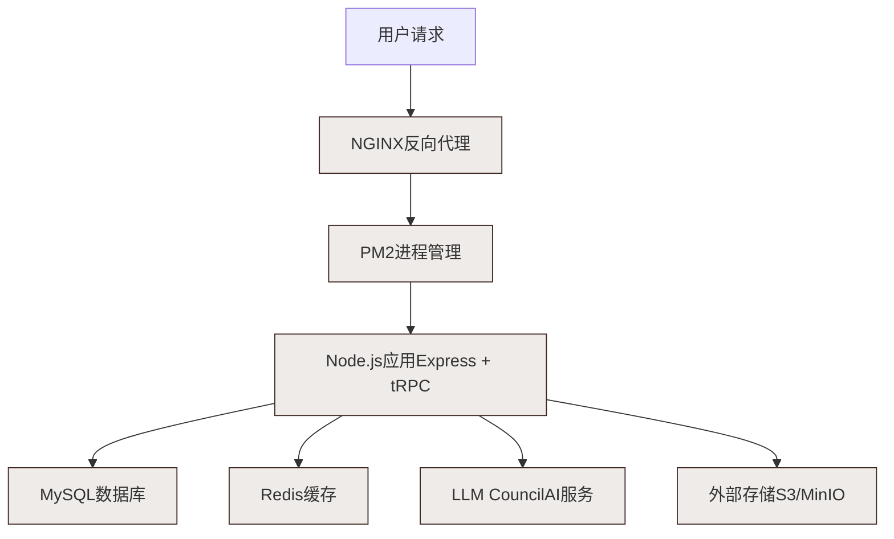

**部署特点**:
- **高可用**: PM2进程管理和自动重启
- **负载均衡**: NGINX反向代理和SSL
- **容器化**: Docker支持，便于部署和扩展

---

## 📈 数据流图

### 用户操作数据流
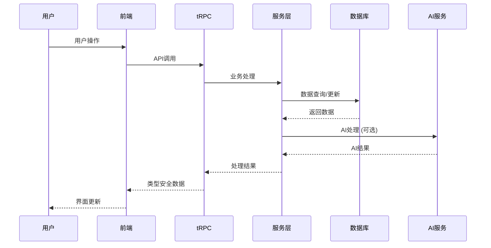

### AI功能调用流
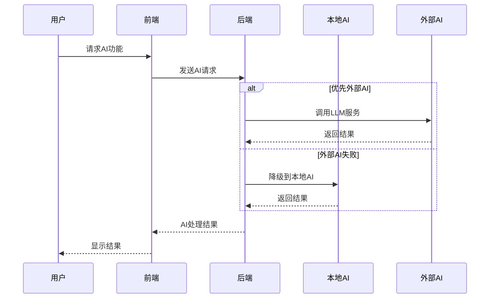

---

## 🏛️ 核心技术栈矩阵

| 层级 | 技术栈 | 版本 | 说明 |
|------|--------|------|------|
| **前端** | React | 19.0 | 最新React版本 |
| | TypeScript | 5.0+ | 类型安全开发 |
| | Tailwind CSS | 4.0 | 现代化样式框架 |
| | tRPC Client | 11.0 | 类型安全API调用 |
| **后端** | Express | 4.x | Node.js Web框架 |
| | tRPC Server | 11.0 | 端到端类型安全 |
| | Drizzle ORM | 最新 | 类型安全数据库操作 |
| **数据库** | MySQL | 5.7+ | 关系型数据库 |
| | Redis | 6.0+ | 缓存数据库（可选） |
| **AI服务** | 本地算法 | - | 规则引擎降级方案 |
| | LLM Council | - | FastAPI AI服务 |
| | OpenRouter | - | 外部AI API |
| **部署** | NGINX | 1.20+ | 反向代理服务器 |
| | PM2 | 最新 | Node.js进程管理 |
| | Docker | 最新 | 容器化部署 |

---

## 🔄 系统工作流程

### 1. 用户注册登录流程
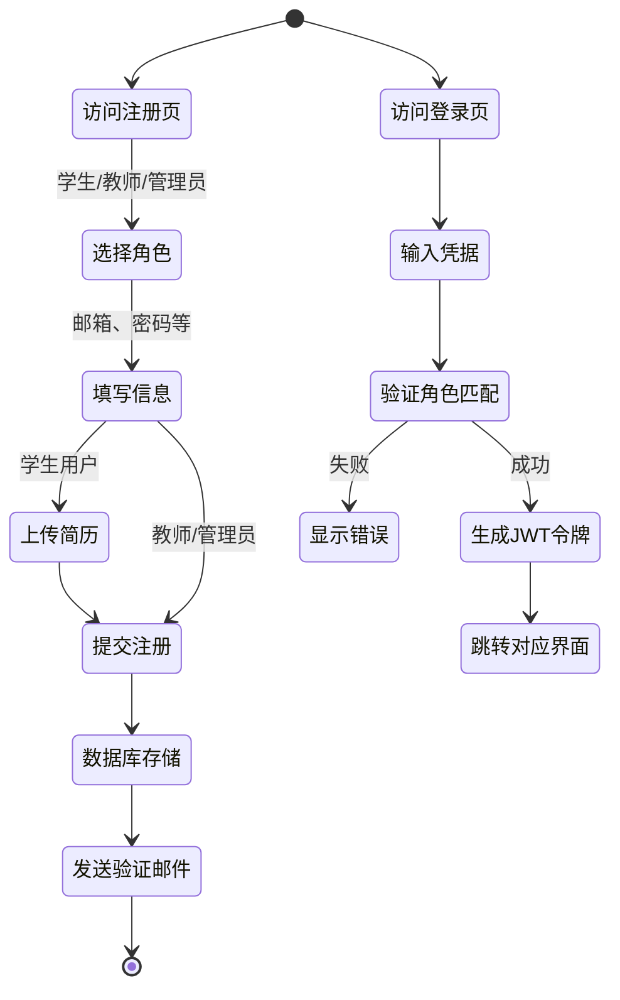

### 2. 项目申请流程
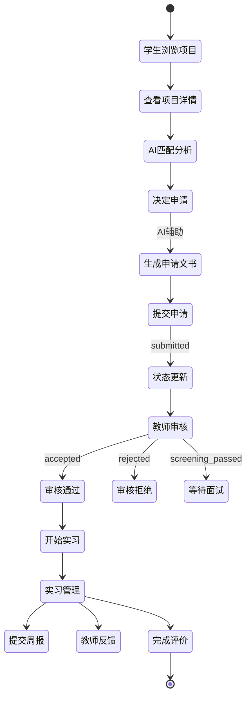

### 3. AI功能处理流程
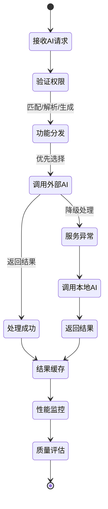

---

## 📊 系统性能指标

### 响应时间目标
| 操作类型 | 目标响应时间 | 实际要求 |
|----------|-------------|----------|
| 页面加载 | < 2秒 | 首屏渲染优化 |
| API调用 | < 500ms | 数据库查询优化 |
| AI匹配 | < 3秒 | 缓存和降级策略 |
| 文件上传 | < 10秒 | 分片上传和进度显示 |

### 并发处理能力
| 用户规模 | 并发用户数 | 系统配置要求 |
|----------|-----------|--------------|
| 小型部署 | 50并发 | 2核CPU/4GB内存 |
| 中型部署 | 200并发 | 4核CPU/8GB内存 |
| 大型部署 | 1000并发 | 8核CPU/16GB内存+ |

### 高可用保障
- **负载均衡**: NGINX多实例部署
- **数据库备份**: 自动备份和恢复机制
- **监控告警**: 系统状态实时监控
- **容灾切换**: 服务异常自动切换

---

## 🔗 相关文档

- [项目概述](../Project%20Overview/README.md) - 系统功能介绍
- [架构设计](../Project%20Overview/ARCHITECTURE_AND_INNOVATION.md) - 详细设计说明
- [数据库设计](../database/SCHEMA.md) - 数据结构说明
- [部署指南](../deployment/DEPLOYMENT.md) - 生产环境部署
- [AI功能详解](../features/ai-functionality-implementation.md) - AI技术实现
 
--- 

## 👥 团队与职责

1. 刘煜飞

负责模块：前端开发与用户界面设计  
核心任务：  
- 设计并实现系统前端页面（登录页、匹配结果展示页、用户信息编辑页等）；  
- 保证前端页面的交互性与响应式布局，适配不同设备；  
- 与后端对接，实现前后端数据交互；  
- 优化前端加载速度与用户体验。  
交付物：前端代码（HTML/CSS/JavaScript/TypeScript）、页面原型设计图、前后端交互文档。

2. 刘佳城

负责模块：后端逻辑开发与 API 设计  
核心任务：  
- 设计后端架构，搭建服务器环境；  
- 开发核心业务逻辑（用户认证、匹配算法调用、数据校验等）；  
- 设计并实现供前端调用的 API，编写 API 文档；  
- 后端异常处理与性能优化。  
交付物：后端代码、API 接口文档、服务器配置说明。

3. 刘城宇

负责模块：数据库设计与数据管理  
核心任务：  
- 设计数据库表结构（用户表、项目表、匹配记录表等），保证数据关系合理性；  
- 实现数据库的增删改查操作；  
- 优化查询性能，处理数据备份与恢复；  
- 与后端协作，提供数据访问支持。  
交付物：数据库设计文档（ER 图）、数据库脚本、备份策略文档。

4. 熊昱浩

负责模块：测试与文档编写  
核心任务：  
- 制定测试计划，编写并执行测试用例（单元/集成/功能测试）；  
- 记录 BUG 并跟踪修复进度；  
- 编写项目文档（需求说明书、用户手册、部署指南）；  
- 协助代码评审，确保代码规范。  
交付物：测试用例文档、BUG 跟踪表、需求说明书、用户手册、部署指南。

---

**图表版本**: v1.0  
**最后更新**: 2024年12月  
**维护者**: 架构设计团队

---

*此架构图基于系统实际技术栈和设计模式绘制，如有变更请及时更新。*
